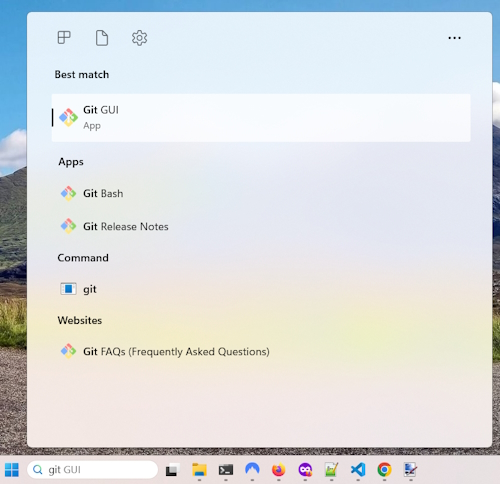

# Using Git &amp; Github to set up a website

**Git** is your local source control system.

**Github** is an online software development platform. It's used for storing, tracking, and collaborating on software projects. It is where you store your repositories. You can make your applications private or public so that other software developers can collaborate with you.

## Download Git for your computer

Git can be downloaded from [git-scm.com](https://git-scm.com/).

On the right-hand side of the page there will be a link to download the Git binaries dependent on your operating system.

This software will work on both Windows or Mac systems. It will install a graphic interface and a Bash Console version of Git.

During this process it should ask you for a user name and an email. If it doesn't we will set these up later.

I have only ever used the Bash Console version of Git so I will describe how to set and use Git through a Console window.

Run the binary file to install Git on your computer. Once you have installed the software do a search for Git. I an using a Windows machine so will show you how I find Git.



I will select the ``Git Bash`` option.


If you have never used a Console application before this may seem fairly confronting but I will guide you through using them.

## Setting up Git on your local machine

Type in this command to check the version of Git you are using.

```bash
    git --version
```

This should return something similar to this.

> git version 2.45.2.windows.1

There are some configuration settings that you need to create so that you can use Git Bash successfully.

### Set the default branch to main

```bash
    git config --global init.defaultBranch main
```

Now every time you create a new Git repository it will start on the ``main`` branch. That is all you need to know about branches for the moment.

Now run this command to view your system settings.

```bash
     git config --list
```

This will give you a list of all your settings. We are only interested in three.

> user.name=Alan Robson     
> user.email=<alanr@live.com.au>      
> init.defaultbranch=main

We know the last one is correct because we just set it.

If either your ``user.name`` or ``user.email`` aren't correct then we can change them with.

```bash
    git config --global user.name "Alan Robson"
```

Or.

```bash
    git config --global user.email "alanr@live.com.au"
```

Change these to suit your details.

Once we have completed this we are finished setting up Git for local use.

## Setting up a Git repository

I am going to add these notes that I am creating into a template for a website. I will create a folder on my computer to hold my files.

In my case the folder will be (for a Windows PC). 

> c:\Git\Netlify-Notes

You probably have a folder on your machine with your website files. You can use this.

To navigate to this folder in Git Bash.

```bash
    cd /c/Git/Netlify-Notes
```

Where:

* ``/c/`` is the **C:** drive on my computer.
* ``Git/Netlify-Notes`` is the folder where I store my website.

**Note:** Git Bash is case sensitive.

## Creating a Git repository

Make sure you are in the correct folder. Run this command.

```bash
    ls
```

This will give you a listing of your files and folders. In my case.


This has my html files and the notes I am creating. It also contains an ``assets`` folder that contains my CSS, JavaScript and images.

We are now ready to initialise our folder as a Git repository.

```bash
    git init
```

You will get a similar message.

> Initialized empty Git repository in C:/Git/Netlify-Notes/.git/

We only have to run this command once and now we have a repository. If you run this command you will see that Git has added some files into your folder.

```bash
    ls -a
```

Returns.


Notice that the folder line has ``(main)`` at the end if it. This means you are going to commit your files to the main branch and this is a really good way to check that you are in a Git repository.

There is a new folder named ``.git`` and this keeps a record of all the commits you do in your repository.

## Adding files to your repository

At present we have initalised our repository but not committed any files to the repository. We can check our status with.

```bash
    git status
```

In my case I see.


