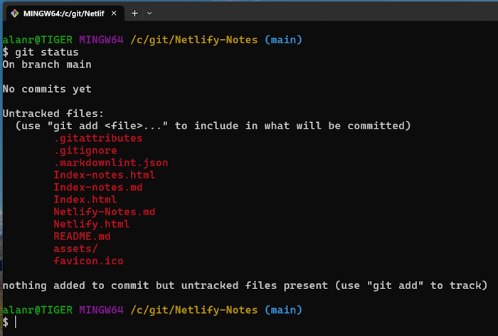
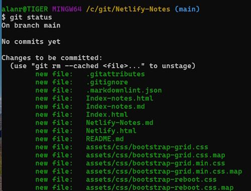
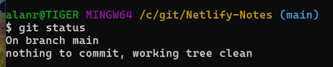
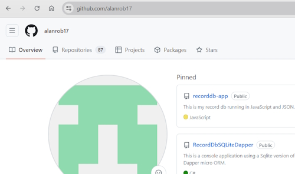
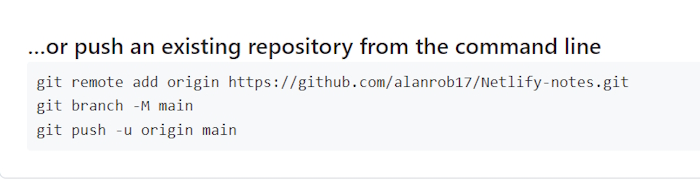
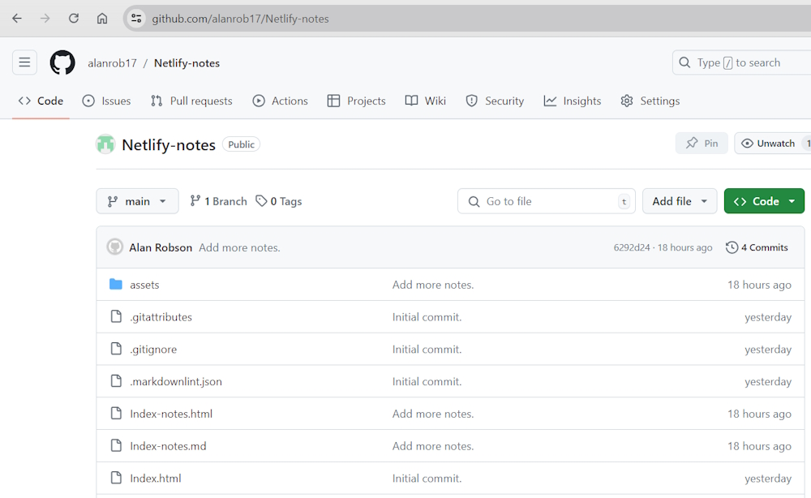

# Using Git &amp; Github to set up a website

**Git** is your local source control system.

**Github** is an online software development platform. It's used for storing, tracking, and collaborating on software projects. It is where you store your repositories. You can make your applications (repositories) private or public so that other software developers can collaborate with you.

The first task in our process is to put all of our website files into our local version of Git.

The next task is to push these files to Github. 

The next task is automatically deploying these files (if they are stable) from Github to Netlify.com. This will be an automated process described later.

## Download Git for your computer

Git can be downloaded from [git-scm.com](https://git-scm.com/).

On the right-hand side of the page there will be a link to download the Git binaries dependent on your operating system.

This software will work on both Windows or Mac systems. It will install a graphic interface program and a Bash Console version of Git.

During this process it should ask you for a user name and an email. If it doesn't we will set these up later.

I have only ever used the Bash Console version of Git so I will describe how to set and use Git through a Console window.

Run the binary file to install Git on your computer. Once you have installed the software do a search for Git. I am using a Windows machine so will show you how I find Git.


I will select the ``Git Bash`` option.


If you have never used a Console application before this may seem fairly confronting but I will guide you through using them.

## Setting up Git on your local machine

Type in this command to check the version of Git you are using.

```bash
    git --version
```

This should return something similar to this. It also tells you that Git is working properly.

> git version 2.45.2.windows.1

There are some configuration settings that you need to create so that you can use Git Bash successfully.

### Set the default branch to main

```bash
    git config --global init.defaultBranch main
```

Now every time you create a new Git repository it will start on the ``main`` branch. That is all you need to know about branches for the moment.

Now run this command to view your system settings.

```bash
     git config --list
```

This will give you a list of all your settings. We are only interested in three.

> user.name=Alan Robson     
> user.email=<alanr@live.com.au>      
> init.defaultbranch=main

We know the last one is correct because we just set it.

If either your ``user.name`` or ``user.email`` aren't correct then we can change them with.

```bash
    git config --global user.name "Alan Robson"
```

Or.

```bash
    git config --global user.email "alanr@live.com.au"
```

Change these to suit your details.

Once we have completed this we are finished setting up Git for local use.

## Setting up a Git repository

I am going to add these notes that I am creating into a template for a website. I will create a folder on my computer to hold my files.

In my case the folder will be (for a Windows PC). 

> c:\Git\Netlify-Notes

You probably have a folder on your machine with your website files. You can use this.

To navigate to this folder in Git Bash.

```bash
    cd /c/Git/Netlify-Notes
```

Where:

* ``/c/`` is the **C:** drive on my computer.
* ``Git/Netlify-Notes`` is the folder where I store my website.

**Note:** Git Bash is case sensitive.

## Creating a Git repository

Make sure you are in the correct folder. Run this command.

```bash
    ls
```

This will give you a listing of your files and folders. In my case.


This has my html files and the notes I am creating. It also contains an ``assets`` folder that contains my CSS, JavaScript and images.

We are now ready to initialise our folder as a Git repository.

```bash
    git init
```

You will get a similar message.

> Initialized empty Git repository in C:/Git/Netlify-Notes/.git/

We only have to run this command once and now we have a repository. If you run this command you will see that Git has added some files into your folder.

```bash
    ls -a
```

Returns.


Notice that the folder line has ``(main)`` at the end if it. This means you are going to commit your files to the main branch and this is a really good way to check that you are in a Git repository.

There is a new folder named ``.git`` and this keeps a record of all the commits you do in your repository.

## Adding files to your repository

At present we have initalised our repository but not committed any files to the repository. We can check our status with.

```bash
    git status
```

In my case I see.



It is telling us that we have untracked files. This basically means these are all new files to Git.

Now we have a couple of steps to commit our repository. First we have to add our files into the staging area.

```bash
    git add .
```

This saves **all** our files to the staging area. It keeps the files here until you commit them. I am deliberately simplifying the process here. 

The period (``.``) specifies all files. 

Run this command again.

```bash
    Git status
```



It shows that the files have been staged which is like a holding area. Notice that Git is giving you some information about where you are in the process.

> (use "git rm --cached <file>..." to unstage)

It is telling you that the files are staged and that, if you wanted to you could unstage them with a command. We won't do that.

Now that they are staged they can be committed. Run this command.

```bash
    git commit -m "Initial commit."
```

``-m`` means add a message about what you are doing. I usually try to keep my messages in present tense. E.g *Fix bug*, not *Fixed bug*.

This will commit all files. In this process we have kept the first version of our software. Run ``Git status`` again to see the state of our repository.



This message is telling use that all of our files are in the local Git repository and are all accounted for.

As soon as we add more files or update our Html content we will have to repeat this process again.

## Git cycle

This looks like a lot of work but the steps are the same for all (nearly all!) of your Git processes.

* First, we create some new files or edit text in our Html.
* Second, we do a ``Git status`` to see the status of our repository.
* Third, we do a ``Git add .`` to push our files to the staging area.
* Last we do a ``Git commit`` to commit our files to the repository. We give the commit a message to explain why we committed the files.

We continuously use ``Git status`` to check the status of our files.

I usually try to commit all of my source code when I finish working or when I finish a particular task in the project.

We just keep on continually doing this cycle to keep a record of what we are doing. This is the basics of Git but occasionally we may want to roll back to a previous version of our software. Git allows us to do this and more. For our tasks we won't have to do this.

Since my last commit I have added more content to my files and added more images so I will do another cycle of ``add`` and ``commit``.

## Git log

``Git log`` is used to give you a list of all the commits that you have carried out.


## Pushing your repository to Github

So far our files are residing on our personal computer. What happens if we accidentally delete them? This is where Github comes in. We can copy our files to Github and download any of our repositories to any computer or place in the world. This is a great form of backup.

We are using Github for a slightly different reason. We will push our files up to Github so that we can also push (deploy) them to Netlify.com. Once we set this up it will be an automated process.

### Create a Github account

[Github link](https://github.com)

You will be asked to add an email address and password. Use the same email address that you used to create Git on your computer.

Once you have created an account you will be sent to a landing page. This is mine.

<https://github.com/alanrob17>



### Create a new Github repository

I will create a new Github repository for my Netlifty-Notes local repository.

Click on the ``Repositories`` link.


This will take you to the Repositories page. Click on the ``New`` button to create a new repository.


Fill in the details for your repository. The name has to be unique. I have called this repository ``Netlify-notes``.

Always give a description of the project.

I am going to make this project ``public`` so that anybody can see it. I suggest you make your website private.


Don't do anything else on this screen except scroll down and click on the ``Create repository`` button.


You will be sent to this screen. Scroll down to the ``...push an existing repository from the command line.`` section.



These are the commands we will use to join our local repository to our Github account.

First we set the remote origin by running this command.

```
    git remote add origin https://github.com/alanrob17/Netlify-notes.git
```

 This doesn't return any messages.


Next we set the ``Main`` branch.

```bash
    git branch -M main
```

Finally we push the local repository to Github.

```bash
    git push -u origin main
```

You will get a message similar to this.


Now your repository is stored on Github.

If you go back to your main page (mine is github.com/alanrob17) you will see your new repository at the top.


Click on the name and it will take you to your Github repository.



This is where you can view all of your website code online. Click on any file to see its contents.

You can also see how many commits you have made to this project and other statistics.

You are also able to download a copy of your files from Github by clicking on the ``Code`` button.

## Add another step to your Git cycle

I previously mentioned these steps.

* First, we create some new files or edit text in our Html.
* Second, we do a ``Git status`` to see the status of our repository.
* Third, we do a ``Git add .`` to push our files to the staging area.
* Last we do a ``Git commit`` to commit our files to the repository. We give the commit a message to explain why we committed the files.

Once we finish these steps we now have another step to push our changes to Github

```bash
    git push
```

This ``pushes`` our changed files to Github.

## What's next

We will now join our Github repository to Netlify.com. Click on the ``Netlify`` link at the top of the page.
