# Using Netlify.com to host our website

Netlify has a free tier for hosting static websites. This is what we will use.

[Create an account with Netlify](https://netlify.com).

There are a number of options for signing up with Netlify. 

* email
* Github
* Gmail

It would probably be a good idea to create an account using your Github account.

Once you have created an account you will be sent to your landing page. 

This is my landing page.

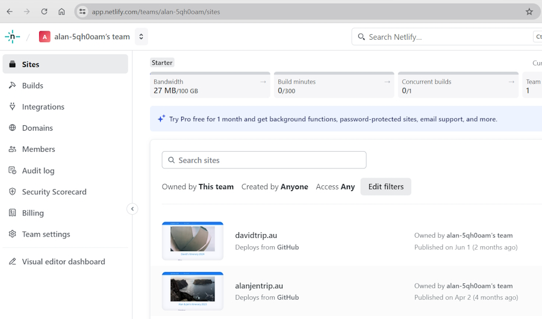

This is where you can manage and maintain your websites. You can also create a new website and I'll create a new website for my Netlify notes.

Over on the right-hand side there is a button for adding a new site. It will show a dropdown menu with a list of options.

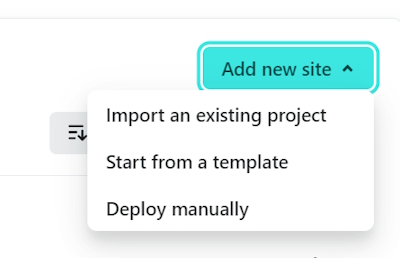

We will choose, ``Import an existing project``.

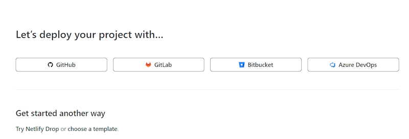

I'll select ``Github``.

It asks me to authorise a connection to my Github account.

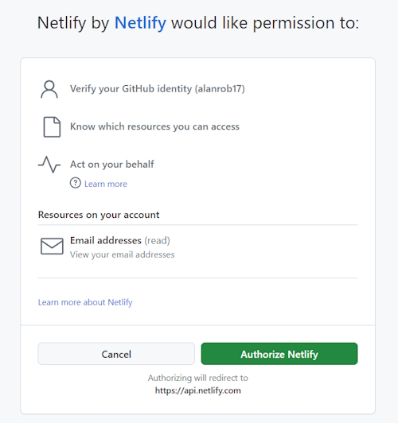

When I click Authorise it shows a list of my Github repositories.

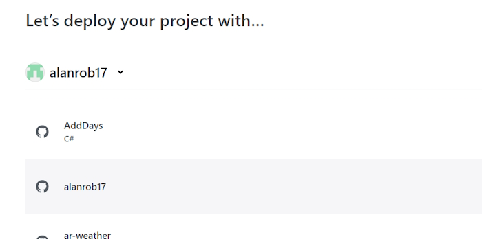

I'll scroll down until I find my ``Netlify-notes`` project.

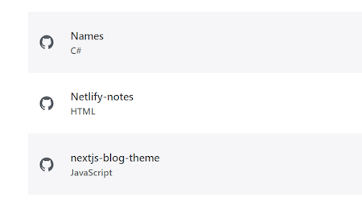

Once I select this it asks me to create a name for the website I want to deploy.

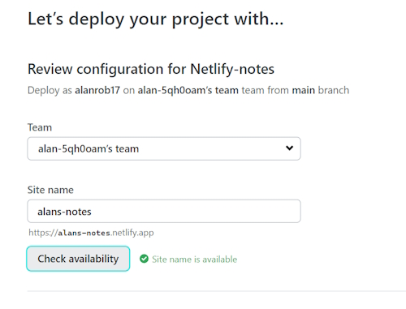

This will create a default domain name for me. I want to use the prefix ``alans-notes`` and it adds ``.netlify.app`` to build up a domain name that I can use for testing. It will check to see if this domain name has been used before. If it hasn't I can continue.

There are a number of other options but we can ignore these.

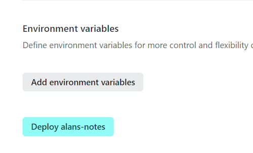

I click on Deploy ``alans-notes`` and it will deploy the website for me. This takes a couple of minutes to build and then I will be presented with the following screen.

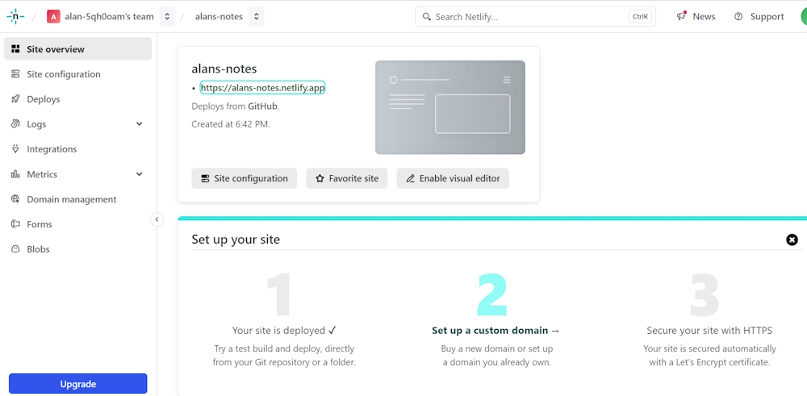

It has finished Step 1 and deployed the site.

Step 2 is the stage where we can point our domain name to the new website on Netlify. This is dependent on where we are currently hosting the domain name. 

We will work on this part later.

This is my testing website for my Netlify notes.

[https://alans-notes.netlify.app/](https://alans-notes.netlify.app/)

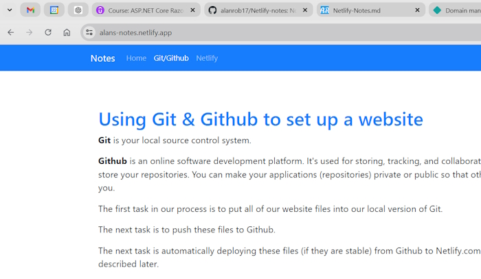

As I said before this is just a testing domain that I can use. I can buy a new domain name for this site or use an existing domain name.

This is an example of a previous website that I have added a domain name to.

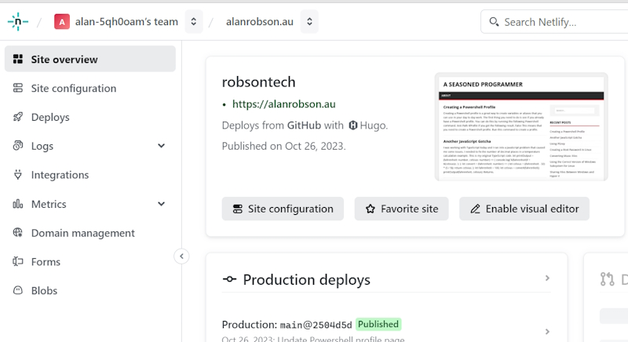

These are my domain details for this website. It is hosted on [VentraIP](https://ventraip.com.au/).

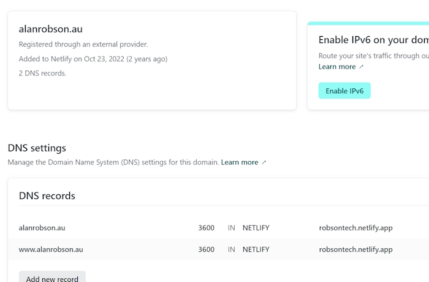

It shows that my domain name is hosted by an external provider. They way we set up the settings for our domain name depends on your provider.
